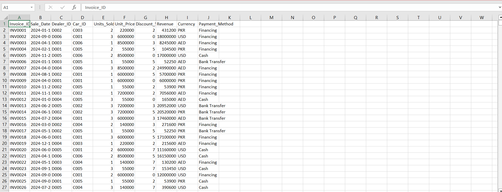
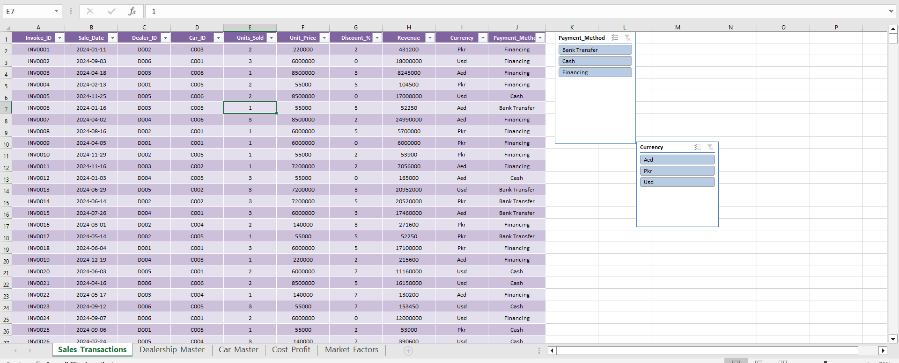
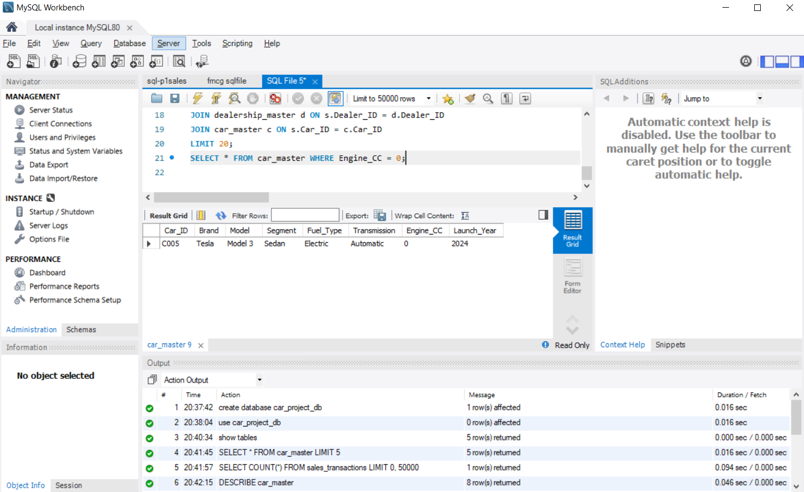
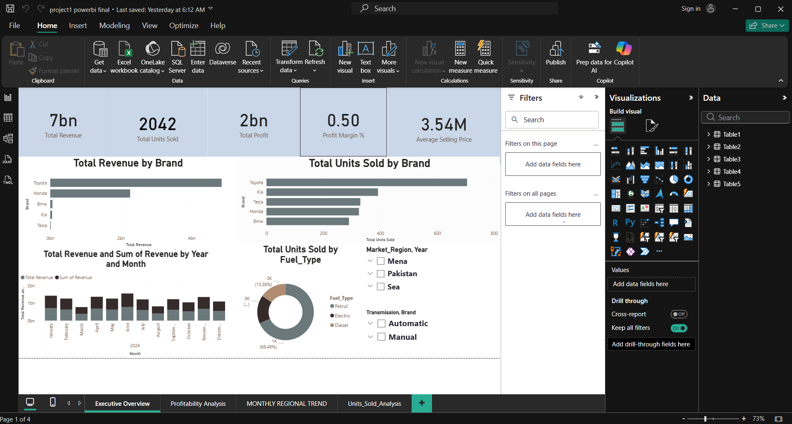

# Global-Automotive-Financial-Intelligence
End-to-End Data Engineering &amp; BI solution analyzing 1,000+ global automotive transactions. Features an automated Python ETL pipeline, a MySQL relational schema, and a Power BI executive dashboard for regional market intelligence.
# 🏎️ Global Automotive Market Analysis & BI Suite
**End-to-End Data Engineering | Multi-Country ETL | Executive Visualization**

---

## 📌 Executive Summary
I engineered a full-stack data pipeline to analyze **1,000+ automotive transactions** across **Pakistan, UAE, and Malaysia**. 

This project demonstrates the transition from fragmented, multi-currency Excel data into a centralized MySQL database, finalized with a high-impact Power BI dashboard. A critical technical challenge involved handling **Electric Vehicle (EV)** logic—such as the Tesla Model 3—ensuring engine displacement (0 CC) was validated as a technical spec rather than missing data.

---

## 🛠️ The Technical Workflow

### 1. Initial Data Auditing (Raw Data)

* **Action:** Audited the source dataset to identify inconsistencies in currency (PKR, AED, MYR) and technical specification gaps.
* **Insight:** Flagged "dirty" data points in the engine CC and price columns that required automated normalization.

---

### 2. Automated ETL & Data Cleaning (Python)

 
*(Note: Using both screenshots to show the full transformation logic)*
* **Action:** Developed a robust **Python (Pandas)** pipeline to automate cleaning. 
* **Key Logic:** Managed the "0 CC" validation for EVs and standardized all regional pricing into a unified format for financial comparison.

---

### 3. Data Integrity Verification (Excel)

* **Action:** Exported and verified the Python output in **Excel** to ensure structural integrity before database injection.
* **Value:** Confirmed that 1,000+ records were 100% accurate and ready for relational modeling.

---

### 4. Relational Database Engineering (SQL)

* **Action:** Migrated the verified data into a **MySQL** environment.
* **Technical Detail:** Engineered a Star-Schema to connect Sales Transactions with Dealership and Market data, allowing for high-performance querying.

---

## 📊 5. Final Executive BI Dashboard

* **Value Added:** Created an interactive **Power BI** suite using **DAX** to track regional revenue, price sensitivity, and top-performing car segments.
* **Business Impact:** Enabled stakeholders to visualize the correlation between regional inflation and car pricing trends across three international markets.

---

## 🛠️ Technical Tech Stack
* **Auditing:** Excel (Pivot Tables, Data Validation)
* **Engineering:** Python (Pandas, NumPy, Regex)
* **Database:** MySQL (Relational Modeling, Schema Design)
* **Intelligence:** Power BI (DAX, Interactive Filtering)

---
